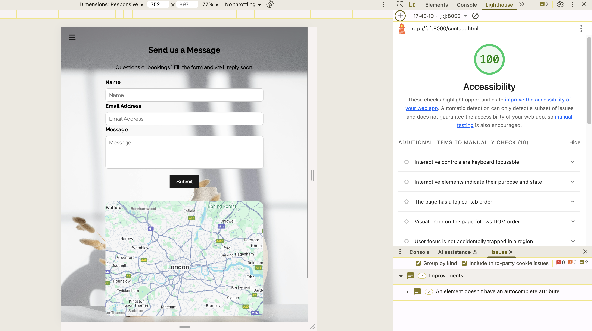
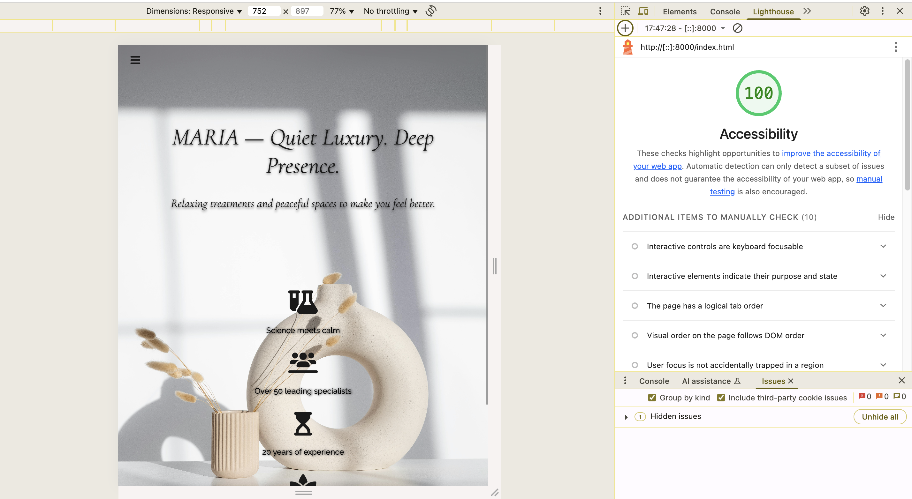

# MARIA | Wellness & Spa

MARIA | Wellness & Spa is a responsive front-end website created as part of the Code Institute Full-Stack Developer course. It represents a fictional high-end spa that values serenity, elegance, and deep human presence. The site aims to give users a peaceful digital experience, aligned with the brand’s motto: **“Quiet Luxury. Deep Presence.”**

Its main purpose is to introduce the spa’s concept, showcase its curated treatments, and make it easy for visitors to learn more or get in touch — all through a minimalist, mobile-friendly design.

[View the live project here](https://oliveiracle.github.io/first-project-maria/)

## UX Design

### Wireframes
Wireframes were created for both desktop and mobile to plan the layout and user flow before building the site.

 **Desktop Layouts**
[Screenshot of the homepage](documentation/wireframes-desktop/wireframe-desktop.jpg)
[Screenshot of the contact page](documentation/wireframes-desktop/wireframe-desktop-contact.jpg)
[Screenshot of the programs page](documentation/wireframes-desktop/wireframe-desktop-programs.jpg)

 **Mobile Layouts**
[Screenshot of the homepage](documentation/wireframes-mobile/wireframe-mobile-contact.jpg)
[Screenshot of the contact page](documentation/wireframes-desktop/wireframe-desktop-contact.jpg)
[Screenshot of the programs page](documentation/wireframes-mobile/wireframe-mobile-programs.jpg)

## Features

### Existing Features

-   **Responsive Navigation Bar** [Screenshot of the mobile menu open](documentation/screenshots/m1.png)
    -   A fixed top navigation bar that adapts across devices. On mobile, it becomes a hamburger menu. It includes links to all main pages and a “Book Your Program” button.

-   **The Hero Section** [Screenshot of the homepage](documentation/screenshots/home.png)
    -   The homepage greets the user with a full-screen, high-quality background image and the brand's main tagline, "Quiet Luxury. Deep Presence." This creates an immediate sense of calm and luxury, setting the tone for the entire experience.
    -   *This feature's value is to instantly communicate the brand's identity and capture the user's interest.*

-   **Programs Page** [Screenshot of the programs page](documentation/screenshots/programs.png)
    -   A dedicated page featuring a grid of beautifully presented "program cards". Each card includes an image, title, description, and a "Book This Treatment" button. The layout is fully responsive and stacks cleanly on mobile devices.
    -   *This feature provides a clear, organized, and visually appealing way for users to browse the services offered.*

-   **Contact Page**  [Screenshot of the contact page](documentation/screenshots/contact.png)
    -   This page includes a simple and functional contact form for inquiries, along with an embedded Google Map for location reference. All form fields have validation to ensure data is submitted correctly.
    -   *This provides a direct and easy way for potential clients to communicate with the spa.*

-   **The Footer**  
    -   The footer is consistent across all pages and contains the spa's address and links to its social media profiles. All external links open in a new tab.
    -   *This feature allows users to find key information and stay connected with the brand without interrupting their Browse experience.*

### Features Left to Implement

-   **Clickable Brand Pillars**
    -   In a future version, the four icons on the homepage could be interactive, revealing more content about each brand value when clicked or hovered.

## Testing

### Manual Testing
A comprehensive testing plan was followed to ensure the site is functional, visually polished, and accessible across different devices.

- All links were tested to ensure they go to the correct destinations.
- The contact form was tested with both valid and invalid inputs.
- External links were checked to open in a new tab.
- The layout was tested on different screen sizes using Chrome DevTools.
- Interactive elements like buttons and menus were tested for proper behavior.

### Validator Testing

-   **HTML**
    -   No errors were returned when passing the code for all three pages through the official [W3C validator](https://validator.w3.org/).
     -  
     -  
     -  
    
-   **CSS**
    -   No errors were found when passing the `style.css` file through the official [(Jigsaw) validator](https://jigsaw.w3.org/css-validator/).
    -   

-   **Accessibility**
    -   The website achieved a perfect score of 100/100 in the Lighthouse accessibility audit, demonstrating its commitment to being usable by all users.
    -   
    -    

-   **Unfied Bugs**
-   No unfixed bugs are known at the time of submission.

## Deployment
- This site was deployed using **GitHub Pages**. Below are the steps followed:

1. On GitHub, go to the repository for this project.
2. Click on the **Settings** tab.
3. In the left sidebar, scroll down to the **Pages** section.
4. Under **Source**, choose the `main` branch and set the folder to `/ (root)`.
5. Click **Save**. GitHub will then deploy the site and provide a link at the top of the page.

You can view the deployed site here:  
👉 [https://oliveiracle.github.io/first-project-maria/](https://oliveiracle.github.io/first-project-maria/)
