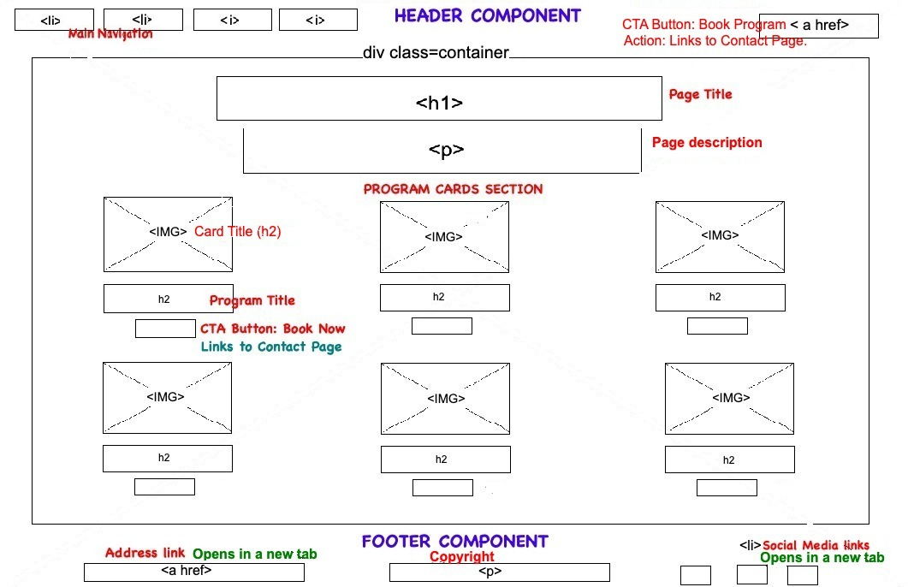

# MARIA | Wellness & Spa

MARIA | Wellness & Spa is a responsive front-end website created as part of the Code Institute Full-Stack Developer course. It represents a fictional high-end spa that values serenity, elegance, and deep human presence. The site aims to give users a peaceful digital experience, aligned with the brand’s motto: **“Quiet Luxury. Deep Presence.”**

Its main purpose is to introduce the spa’s concept, showcase its curated treatments, and make it easy for visitors to learn more or get in touch — all through a minimalist, mobile-friendly design.

[View the live project here](https://oliveiracle.github.io/first-project-maria/)

## Technologies Used
- HTML5
- CSS3
- Git & GitHub
- VS Code

## UX Design

### Colour Palette
I chose a very simple color palette to bring the 'Quiet Luxury' theme to life. By sticking to soft whites, deep grays, and black, the goal was to create a calm and elegant space for the user. I avoided any bright colors to keep the focus on the content and maintain a serene feel.
                                                                                    
- **Charcoal:** Used for primary text, headers, and footers for high contrast.
- **Medium Gray:** Used for secondary body text to be softer on the eyes.
- **Off-White & Pure White:** Used for backgrounds and highlighted text to create a clean, serene canvas.

### Typography
For the fonts, I wanted to create a nice contrast. I used:

- **Cormorant Garamond:** for the main titles to give the site that elegant, high-end personality.
- **Raleway:** for paragraphs, buttons, and menus. It's a really clean and simple font, which makes all the information comfortable and easy to read on any screen.

### Wireframes

Wireframes were created for both desktop and mobile to plan the layout and user flow before building the site.

#### Desktop - Home Page

#### Desktop - Contact Page

#### Desktop - Programs Page

---

#### Mobile - Home Page

#### Mobile - Contact Page

#### Mobile - Programs Page

## Features

### Existing Features

-   **Responsive Navigation Bar** 
   
    -  The navigation bar is designed for an intuitive Browse experience. It stays fixed at the top for easy access and seamlessly transforms into a clean hamburger menu on mobile. This ensures users can find what they need—from treatment pages to the “Book Your Program” button—from anywhere on the site, on any device.

-   **The Hero Section** 
   
    -   The first thing visitors see is a stunning, full-screen hero image paired with the brand's motto: "Quiet Luxury. Deep Presence." This serves as an immediate immersion into the spa's serene and high-end atmosphere, designed to capture attention and set a calm tone for the entire visit.

-   **Programs Page** 
   
    -   Visitors can explore the spa's offerings on a visually-driven Programs page. Each treatment is presented in a clean "card" with a beautiful image and clear description, making it enjoyable for potential clients to browse and find a service that resonates with them. The grid layout is fully responsive.

-   **Contact Page**
   
    -   Getting in touch is made easy. The Contact Page features a straightforward inquiry form and an embedded Google Map to help clients find the spa's location. It uses the Formspree service to handle form submissions, ensuring inquiries are reliably sent to the site owner's email.

-   **The Footer**  
   
    -   A clean footer is present on every page, providing easy access to the spa's address and social media profiles. This allows users to connect with the brand on other platforms or find key information at any point in their journey without interrupting their experience.

### Features Left to Implement

-   **Clickable Brand Pillars**
    -   In a future version, the four icons on the homepage could be interactive, revealing more content about each brand value when clicked or hovered.

## Testing

### Manual Testing
A comprehensive testing plan was followed to ensure the site is functional, visually polished, and accessible across different devices.

- All links were tested to ensure they go to the correct destinations.
- The contact form was tested with both valid and invalid inputs.
- External links were checked to open in a new tab.
- The layout was tested on different screen sizes using Chrome DevTools.
- Interactive elements like buttons and menus were tested for proper behavior.

### Validator Testing

-   **HTML**
    -   No errors were returned when passing the code for all three pages through the official [W3C validator](https://validator.w3.org/).
     -  
     -  
     -  
    
-   **CSS**
    -   No errors were found when passing the `style.css` file through the official [(Jigsaw) validator](https://jigsaw.w3.org/css-validator/).
    -   

-   **Accessibility**
    -   The website achieved a perfect score of 100/100 in the Lighthouse accessibility audit, demonstrating its commitment to being usable by all users.
    -   
    -    

-   **Unfied Bugs**
-   - **Minor Visual Issue on Tall Mobile Screens:** On very tall and narrow viewports (e.g., Samsung Galaxy S23 Ultra), if the page content on the homepage is shorter than the screen height, a small white bar may be visible below the footer. This is a cosmetic issue that does not affect site functionality or structural integrity. The decision was made to acknowledge it as a known issue for a future update, prioritizing the stability of the current layout over a complex CSS change that could introduce further issues.

## Deployment
- This site was deployed using **GitHub Pages**. Below are the steps followed:

1. On GitHub, go to the repository for this project.
2. Click on the **Settings** tab.
3. In the left sidebar, scroll down to the **Pages** section.
4. Under **Source**, choose the `main` branch and set the folder to `/ (root)`.
5. Click **Save**. GitHub will then deploy the site and provide a link at the top of the page.

You can view the deployed site here:  
👉 [https://oliveiracle.github.io/first-project-maria/](https://oliveiracle.github.io/first-project-maria/)

## Credits

### Content & Design Inspiration
* **Primary Aesthetic:** The overall branding concept and service descriptions were heavily inspired by the official [La Prairie Spa](https://www.laprairie.com/en-us/spa) website.
* **Color Palette:** The minimalist, monochromatic color scheme draws inspiration from the clean and sophisticated branding of Kim Kardashian's product lines.
* **Minimalist Interface:** The clean, uncluttered user interface and focus on essential information were inspired by the interior design of the SpaceX Dragon spacecraft and the sober, screen-centric dashboard of Tesla vehicles.
* **README Structure:** The core concepts for the README file structure were adapted from the Code Institute Full-Stack Developer course template.

### Media
* All photographic images used on the website were sourced from [Pexels](https://www.pexels.com/).
* The icons used in the footer are from [Font Awesome](https://fontawesome.com/).

### Acknowledgements
* **Microsoft Paint:** Used for the initial wireframing process to map out the basic site structure.
* **Responsive Design:** Solutions for the responsive media queries and the mobile hamburger menu toggle were adapted and implemented based on various online resources and tutorials, including CSS-Tricks and Stack Overflow.
* **Google:** Utilized for conceptual brainstorming, professional phrasing, and debugging assistance throughout the project.
* **GitHub Copilot:** Assisted in the organization of the CSS file structure and provided code completion within VS Code.
* **Formspree:** Used as the form backend service to handle submissions from the contact page.

