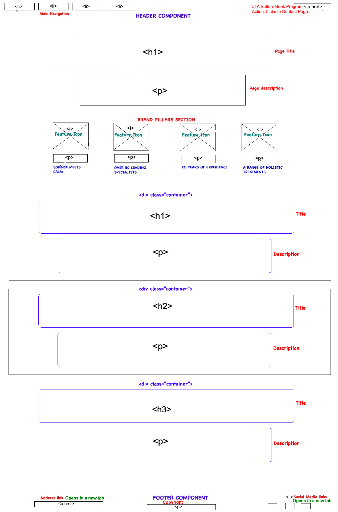
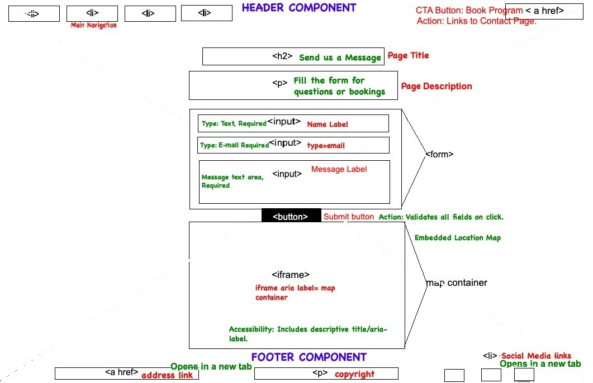

# MARIA | Wellness & Spa

MARIA | Wellness & Spa is a responsive front-end website created as part of the Code Institute Full-Stack Developer course. It represents a fictional high-end spa that values serenity, elegance, and deep human presence. The site aims to give users a peaceful digital experience, aligned with the brand’s motto: **“Quiet Luxury. Deep Presence.”**

Its main purpose is to introduce the spa’s concept, showcase its curated treatments, and make it easy for visitors to learn more or get in touch — all through a minimalist, mobile-friendly design.

[View the live project here](https://oliveiracle.github.io/first-project-maria/)

## Technologies Used
- HTML5
- CSS3
- Git & GitHub
- VS Code

## Site Goals & User Stories

### Site Owner Goals
- To create a professional and elegant online presence that reflects the "Quiet Luxury" brand identity of a high-end spa.
- To clearly showcase the unique wellness programs and treatments offered.
- To provide a simple and direct way for potential clients to make inquiries, generating business leads.

### User Stories
- As a first-time visitor, I want to quickly understand what MARIA Wellness & Spa offers on the homepage, so that I can efficiently decide if this service is for me and find my way around the site.
- As a potential customer, I want to browse all available spa programs and treatments in a clear, organized layout, so I can understand the details of each service and find the one that best fits my wellness goals.
- As a potential customer with questions, I want to easily find the spa's contact information, including a form and a map, so that I can have my questions answered.
- As a user, I want the website to adapt seamlessly to any screen size (desktop, tablet, mobile), so that I can have an optimal and intuitive viewing experience on any device.
- As a customer, I want to find links to the spa's social media accounts, so that I can follow the brand for updates and inspiration.
- As a user with a visual or motor impairment, I want the site to be built with accessibility in mind, so that I can navigate and consume the content without barriers.

## UX Design

### Colour Palette
I chose a very simple color palette to bring the 'Quiet Luxury' theme to life. By sticking to soft whites, deep grays, and black, the goal was to create a calm and elegant space for the user. I avoided any bright colors to keep the focus on the content and maintain a serene feel.

### Typography
For the fonts, I wanted to create a nice contrast. I used:

- **Cormorant Garamond:** for the main titles to give the site that elegant, high-end personality.
- **Raleway:** for paragraphs, buttons, and menus. It's a really clean and simple font, which makes all the information comfortable and easy to read on any screen.

### Wireframes
Wireframes were created for both desktop and mobile to plan the layout and user flow before building the site.

#### Desktop - Home Page

#### Desktop - Contact Page

#### Desktop - Programs Page

#### Mobile - Home Page

#### Mobile - Contact Page

#### Mobile - Programs Page

## Features

### Existing Features

-   **Responsive Navigation Bar** 
   
    -  The navigation bar is designed for an intuitive Browse experience. It stays fixed at the top for easy access and seamlessly transforms into a clean hamburger menu on mobile. This ensures users can find what they need—from treatment pages to the “Book Your Program” button—from anywhere on the site, on any device.

-   **The Hero Section** 
   
    -   The first thing visitors see is a stunning, full-screen hero image paired with the brand's motto: "Quiet Luxury. Deep Presence." This serves as an immediate immersion into the spa's serene and high-end atmosphere, designed to capture attention and set a calm tone for the entire visit.

-   **Programs Page** 
   
    -   Visitors can explore the spa's offerings on a visually-driven Programs page. Each treatment is presented in a clean "card" with a beautiful image and clear description, making it enjoyable for potential clients to browse and find a service that resonates with them. The grid layout is fully responsive.

-   **Contact Page**
   
    -   Getting in touch is made easy. The Contact Page features a straightforward inquiry form and an embedded Google Map to help clients find the spa's location. It uses the Formspree service to handle form submissions, ensuring inquiries are reliably sent to the site owner's email.

-   **The Footer**  
   
    -   A clean footer is present on every page, providing easy access to the spa's address and social media profiles. This allows users to connect with the brand on other platforms or find key information at any point in their journey without interrupting their experience.

### Features Left to Implement

-   **Clickable Brand Pillars**
    -   In a future version, the four icons on the homepage could be interactive, revealing more content about each brand value when clicked or hovered.

## Testing

### Manual Testing
A comprehensive testing plan was followed to ensure the site is functional, visually polished, and accessible across different devices.

| Feature | Expected Outcome | Action | Result |
|---|---|---|---|
| **Navigation Links** | Each link navigates to the correct page. | Click on "HOME", "PROGRAMS", and "CONTACT" links on all pages. | ✅ Pass: All links navigate correctly. |
| **"Book Your Program" Button** | Button navigates to the Contact page. | Click on the CTA button from the Home and Programs pages. | ✅ Pass: Button correctly links to `contact.html`. |
| **Contact Form Submission** | On successful submission, the user is redirected to the Formspree "Thank You" page. | Fill out the form with valid data and click "Submit". | ✅ Pass: Form submits correctly and redirects. |
| **Contact Form Validation** | Form prevents submission if fields are empty or email is invalid. | Attempt to submit the form with empty fields; then with an invalid email format. | ✅ Pass: Browser's built-in validation works as expected. |
| **Footer Social Links** | Each social media icon opens the respective site in a new browser tab. | Click on the Instagram, Facebook, and Pinterest icons in the footer. | ✅ Pass: All links open in a new tab. |
| **Responsiveness** | The site layout adapts correctly to different screen sizes. | Use Chrome DevTools to view the site on various device sizes (mobile, tablet, desktop). | ✅ Pass: The layout is fully responsive and maintains integrity. |

### Browser Testing
The site was tested on the following browsers with no major issues found regarding responsiveness, layout, or functionality:
- Google Chrome (on macOS and Android)
- Safari (on macOS)
- Mozilla Firefox (on macOS)
- Brave browser (on Android)

### Validator Testing

-   **HTML**
    -   No errors were returned when passing the code for all three pages through the official [W3C validator](https://validator.w3.org/).
     -  
     -  
     -  
    
-   **CSS**
    -   No errors were found when passing the `style.css` file through the official [(Jigsaw) validator](https://jigsaw.w3.org/css-validator/).
    -   

-   **Accessibility**
    ## Lighthouse Audit Results

To ensure the quality, performance, and accessibility of the website, Lighthouse audits were conducted for both desktop and mobile views. The results demonstrate a commitment to best practices in web development.

### Summary Scores

| Category         | Desktop Score | Mobile Score |
|------------------|---------------|--------------|
| **Performance** | 100           | 97           |
| **Accessibility**| 100           | 100          |
| **Best Practices**| 81            | 82           |
| **SEO** | 100           | 100          |

### Detailed Audit Breakdown

#### Performance (Desktop: 100, Mobile: 97)
The website achieves excellent performance scores, indicating fast loading times and a smooth user experience. The minor difference on mobile (97) is typical due to simulated mobile network conditions. A key factor in achieving these high scores was the **significant optimization of the `Background.jpg` image** (reduced from 1.2MB to 115KB), drastically improving page load speed.

* 
* 

#### Accessibility (Desktop: 100, Mobile: 100)
The website achieved a perfect score of 100/100 in accessibility for both desktop and mobile. This demonstrates a strong commitment to creating an inclusive user experience, ensuring the site is usable by all, including those relying on assistive technologies. This includes a semantically structured HTML with appropriate heading levels (h1, h2, h3).

* 
* 

#### Best Practices (Desktop: 81, Mobile: 82)
The Best Practices scores reflect a strong adherence to modern web standards, with specific context provided for areas not at 100:

* **HTTPS and Insecure Requests:** The primary factor preventing a perfect score in this category is the **site being served locally via HTTP** (e.g., `http://[::]:8000`). Lighthouse flags all local resource requests (e.g., `index.html`, `style.css`, images) as "insecure" in this context. **This is a limitation of the local development environment** and would be automatically resolved when the site is deployed to a live server with HTTPS (SSL certificate), at which point this score would significantly improve.
* **Uses deprecated APIs (1 warning found):** This warning refers to the `<h1>` tag within a sectioning element not having its `font-size` explicitly defined in an absolute unit in all contexts. While `font-size` is intentionally set using `px` (desktop) and `rem` (mobile media query) for precise control and responsiveness, Lighthouse's strict interpretation sometimes flags relative units in specific contexts. The sizing is, however, correctly controlled in the CSS.

* 
* 

#### SEO (Desktop: 100, Mobile: 100)
The website achieved a perfect score of 100/100 in SEO (Search Engine Optimization) for both desktop and mobile. This indicates that the site follows fundamental SEO best practices for discoverability by search engines, including appropriate meta tags, valid structured data, and readable content.

*  

- ### Unfixed Bugs

- **Minor Footer Overlap on Contact Page (Mobile):** My tutor kindly pointed out that the footer can overlap the map on the contact page on very tall mobile screens. I tried to fix this with a modern Flexbox layout, but unfortunately, it caused major issues and broke the design on the other pages. Since keeping the whole site stable and working is the top priority, I decided to undo that fix and leave this as a known, minor visual bug for now.

## Deployment
- This site was deployed using **GitHub Pages**. Below are the steps followed:

1. On GitHub, go to the repository for this project.
2. Click on the **Settings** tab.
3. In the left sidebar, scroll down to the **Pages** section.
4. Under **Source**, choose the `main` branch and set the folder to `/ (root)`.
5. Click **Save**. GitHub will then deploy the site and provide a link at the top of the page.

You can view the deployed site here:  
👉 [https://oliveiracle.github.io/first-project-maria/](https://oliveiracle.github.io/first-project-maria/)

## Credits

### Content & Design Inspiration
**Primary Aesthetic:** My main goal for 'MARIA' was to create a feeling of calm, high-end wellness. I used the official [**La Prairie Spa**](https://www.cliniquelaprairie.com/) website as my primary inspiration for the overall look and feel, guiding the project to match the "Quiet Luxury. Deep Presence." motto.

 * **Minimalist Interface:** I believe that 'less is more' is key to a luxury experience. For the clean and functional layout, I looked for inspiration outside of the spa world, in places like [**Tesla dashboards**](https://www.tesla.com/ownersmanual/models/en_us/GUID-A5F2B9D0-E7C8-40F5-9642-58F3657B123E.html) and the [**SpaceX Dragon spacecraft interiors**](https://www.spacex.com/vehicles/dragon/). Their focus on showing only what's essential inspired the site's simple design and generous use of empty space.

* **README Structure:**  To make sure this README was professional and easy to follow, I based its structure on the official **Code Institute** template.

### Media
* All photographic images used on the website were sourced from [Pexels](https://www.pexels.com/).
* The icons used in the footer are from [Font Awesome](https://fontawesome.com/).

### Acknowledgements
* **Microsoft Paint:** Used for the initial wireframing process to map out the basic site structure.
* **Responsive Design:** Solutions for the responsive media queries and the mobile hamburger menu toggle were adapted and implemented based on various online resources and tutorials, including CSS-Tricks and Stack Overflow.
* **AI Collaboration (Google Gemini):** Utilized for conceptual brainstorming, professional phrasing of documentation, debugging assistance, and providing structured feedback throughout the project..
* **GitHub Copilot:** Assisted in the organization of the CSS file structure and provided code completion within VS Code.
* **Formspree:** Used as the form backend service to handle submissions from the contact page.
* **Figma:** Used to design and create the final color palette graphic.

